# Life Is Tempo

> 🏃‍♂️ Training for Berlin 70.3 (Ironman) from Colombia 🇨🇴 • Underground Techno Culture 🎵 • Personal Documentation

A personal blog and newsletter platform documenting the journey of endurance sports training while immersed in techno culture. Chronicles the intersection of athletic dedication, music passion, and productivity systems.

[](https://vercel.com)
[](./docs/architecture/security-architecture.md)
[](./LICENSE)

## ✨ Features

- 🌍 **Multi-language**: English and Spanish with automatic detection
- 📝 **MDX Blog**: Markdown + React components for rich content
- 📧 **Newsletter**: Subscriber management with double opt-in
- 🎨 **Modern UI**: Tailwind CSS 4 with responsive design
- 🔒 **Security-First**: Comprehensive headers, validation, and scanning
- ⚡ **Performance**: Next.js 16 with React 19 Server Components
- 🌐 **Global CDN**: Vercel Edge Network with <50ms latency

## Getting Started

### Prerequisites

- Node.js 18+ or Bun
- pnpm (recommended) or npm

### Installation

1. Clone the repository:
```bash
git clone https://github.com/juancmandev/life-is-tempo.git
cd life-is-tempo
```

2. Install dependencies:
```bash
pnpm install
```

3. Set up environment variables:
```bash
cp .env.example .env.local
# Edit .env.local with your configuration
```

4. Run the development server:
```bash
pnpm dev
```

Open [http://localhost:3000](http://localhost:3000) to see the application.

## Environment Setup

This project uses environment variables for configuration. See `.env.example` for all available options.

**Required variables:**
- None for basic development

**Optional variables:**
- `NEXT_PUBLIC_GA_MEASUREMENT_ID` - Google Analytics tracking ID
- `NEWSLETTER_API_KEY` - Newsletter service API key
- `NEWSLETTER_AUDIENCE_ID` - Newsletter list ID

See [.env.example](./.env.example) for the complete list.

## Security

We take security seriously. This project implements:

- ✅ Comprehensive security headers (CSP, HSTS, X-Frame-Options)
- ✅ Environment variable validation at build time
- ✅ Automated dependency vulnerability scanning
- ✅ Input validation and sanitization
- ✅ Rate limiting on API routes

See [SECURITY.md](./SECURITY.md) for:
- How to report security vulnerabilities
- Security best practices
- Supported versions

## 📖 Documentation

Comprehensive documentation available in [`/docs`](./docs):

### Architecture
- **[System Overview](./docs/architecture/system-overview.md)** - High-level architecture and technology stack
- **[Security Architecture](./docs/architecture/security-architecture.md)** - Security implementation and threat model
- **[Architecture Diagrams](./docs/architecture/diagrams.md)** - Mermaid diagrams (routing, security, deployment)

### Deployment
- **[Vercel Deployment Guide](./docs/deployment/vercel-deployment.md)** - Step-by-step deployment process
- **[Environment Variables](./docs/deployment/environment-variables.md)** - Complete variable reference

### Development
- **[Getting Started](./docs/development/getting-started.md)** - Local setup and development workflow
- **[Content Authoring](./docs/development/content-authoring.md)** - Writing blog posts with MDX
- **[Internationalization](./docs/development/internationalization.md)** - Multi-language workflow

### Components
- **[Component Catalog](./docs/components/README.md)** - Reusable component documentation

### Project-Specific Patterns
- **[CLAUDE.md](./CLAUDE.md)** - Development patterns and conventions

---

## 🏗️ Architecture

```mermaid
graph TB
    Browser["👤 User Browser"]
    Edge["☁️ Vercel Edge Network"]
    NextJS["⚡ Next.js App<br/>• SSG/SSR<br/>• Multi-language<br/>• Security Middleware"]
    External["🔌 External Services<br/>• Newsletter<br/>• Analytics"]

    Browser -->|HTTPS| Edge
    Edge -->|Route to origin| NextJS
    NextJS -.->|API Calls| External

    style Browser fill:#e3f2fd
    style Edge fill:#f3e5f5
    style NextJS fill:#e8f5e9
    style External fill:#fff3e0
```



**Key Characteristics**:
- **Frontend-Only**: No backend APIs (static site + external services)
- **Multi-Language**: Automatic locale detection with next-intl
- **Security-First**: Defense-in-depth with multiple security layers
- **Global CDN**: Edge network for fast worldwide access

See [System Overview](./docs/architecture/system-overview.md) for detailed architecture.

---

## 🚀 Quick Start

### Prerequisites

- **Node.js** 18.17+ or 20.x LTS
- **pnpm** 8.0+ (recommended)
- **Git** 2.30+

### Installation

### Scripts

- `pnpm dev` - Start development server
- `pnpm build` - Build for production
- `pnpm start` - Start production server
- `pnpm lint` - Run ESLint
- `pnpm security-check` - Check for dependency vulnerabilities

### Code Style

This project uses:
- TypeScript for type safety
- ESLint for code quality
- Prettier for code formatting (planned)

## Tech Stack

- **Framework**: Next.js 16 (App Router)
- **UI**: React 19, Tailwind CSS 4
- **Content**: MDX
- **Internationalization**: next-intl
- **Type Safety**: TypeScript, Zod
- **Security**: @t3-oss/env-nextjs

## Deployment

### Vercel (Recommended)

1. Push your code to GitHub
2. Import the project in [Vercel](https://vercel.com)
3. Configure environment variables in Vercel dashboard
4. Deploy!

See [Next.js deployment documentation](https://nextjs.org/docs/app/building-your-application/deploying) for other platforms.

## 🤝 Contributing

Contributions are welcome! Please follow these steps:

1. **Fork** the repository
2. **Create** a feature branch (`git checkout -b feature/amazing-feature`)
3. **Commit** your changes (`git commit -m 'Add amazing feature'`)
4. **Test** your changes:
   ```bash
   pnpm lint          # Run linting
   pnpm build         # Verify build succeeds
   pnpm security-check # Check vulnerabilities
   ```
5. **Push** to your branch (`git push origin feature/amazing-feature`)
6. **Open** a Pull Request

**Before Submitting**:
- Review [Development Guidelines](./docs/development/getting-started.md)
- Follow code standards in [CLAUDE.md](./CLAUDE.md)
- Add tests for new features (when test suite is implemented)
- Update documentation if needed

**Need Help?** Check out our [Getting Started Guide](./docs/development/getting-started.md) or open an issue.

## License

This project is open source and available under the [MIT License](./LICENSE).

## 📚 Learn More

### Project Documentation
- [Architecture Overview](./docs/architecture/system-overview.md)
- [Deployment Guide](./docs/deployment/vercel-deployment.md)
- [Development Setup](./docs/development/getting-started.md)
- [Security Policy](./SECURITY.md)

### Framework Documentation
- [Next.js Docs](https://nextjs.org/docs) - Next.js framework
- [React Docs](https://react.dev) - React library
- [Tailwind CSS](https://tailwindcss.com/docs) - Utility-first CSS
- [next-intl](https://next-intl-docs.vercel.app) - Internationalization
- [MDX](https://mdxjs.com) - Markdown with JSX

### Platform
- [Vercel Docs](https://vercel.com/docs) - Deployment platform
- [Vercel CLI](https://vercel.com/docs/cli) - Command-line interface

---

## 📬 Contact

- **Website**: [lifeistempo.com](https://lifeistempo.com)
- **Email**: security@lifeistempo.com (for security concerns)
- **GitHub**: [@juancmandev](https://github.com/juancmandev)
- **Issues**: [GitHub Issues](https://github.com/juancmandev/life-is-tempo/issues)

---

## 📄 License

This project is open source and available under the [MIT License](./LICENSE).

---

<div align="center">

**Built with ❤️ by Juan Carlos Martínez**

Training for Berlin 70.3 • Techno Culture • Colombia 🇨🇴 → Berlin 🇩🇪

[Website](https://lifeistempo.com) • [Documentation](./docs) • [Security](./SECURITY.md)

</div>
