# Architecture Diagrams

**Last Updated**: 2026-02-11

This document contains Mermaid diagrams visualizing the Life Is Tempo architecture.

---

## System Architecture

### High-Level System Flow

```mermaid
graph TB
    Browser["👤 User Browser<br/>(Chrome, Firefox, Safari)"]
    Edge["☁️ Vercel Edge Network<br/>• Global CDN (30+ regions)<br/>• DDoS protection<br/>• TLS/SSL termination"]
    NextJS["⚡ Next.js 16 Application<br/>• Server-Side Rendering<br/>• Static Site Generation<br/>• Security Middleware"]
    External["🔌 External Services"]

    Browser -->|"HTTPS Request"| Edge
    Edge -->|"Route to origin"| NextJS
    NextJS -->|"API Calls (future)"| External

    subgraph "External Services"
        Newsletter["📧 Newsletter<br/>Loops.so / Resend"]
        Analytics["📊 Analytics<br/>Google Analytics<br/>Vercel Analytics"]
        AI["🤖 AI Content<br/>OpenAI / Anthropic<br/>(planned)"]
    end

    NextJS -.->|"Newsletter signup"| Newsletter
    NextJS -.->|"Tracking"| Analytics
    NextJS -.->|"Content generation"| AI

    style Browser fill:#e3f2fd
    style Edge fill:#f3e5f5
    style NextJS fill:#e8f5e9
    style External fill:#fff3e0
```

---

## Security Architecture

### Security Layers

```mermaid
graph TD
    Request["🌐 HTTP Request"] --> Layer1

    Layer1["🛡️ Layer 1: Vercel Edge<br/>• DDoS Protection<br/>• TLS/SSL<br/>• Edge Rate Limiting"]
    Layer2["🔒 Layer 2: Security Headers<br/>• CSP<br/>• HSTS<br/>• X-Frame-Options"]
    Layer3["✅ Layer 3: Application<br/>• Input Validation<br/>• Environment Validation<br/>• Rate Limiting (API routes)"]
    Layer4["🔑 Layer 4: External Services<br/>• API Key Management<br/>• OAuth Tokens<br/>• Service-level Security"]

    Layer1 --> Layer2
    Layer2 --> Layer3
    Layer3 --> Layer4

    Layer4 --> Response["✨ Secure Response"]

    style Request fill:#ffebee
    style Layer1 fill:#e8f5e9
    style Layer2 fill:#e3f2fd
    style Layer3 fill:#fff3e0
    style Layer4 fill:#f3e5f5
    style Response fill:#c8e6c9
```

### Security Headers Flow

```mermaid
sequenceDiagram
    participant Browser
    participant Vercel as Vercel Edge
    participant NextJS as Next.js App
    participant Config as next.config.ts

    Browser->>Vercel: GET /en
    Vercel->>NextJS: Forward request
    NextJS->>Config: Load security headers
    Config-->>NextJS: Return headers array

    Note over NextJS: Apply headers:<br/>• CSP<br/>• HSTS<br/>• X-Frame-Options<br/>• X-Content-Type-Options<br/>• Referrer-Policy

    NextJS->>NextJS: Render page
    NextJS-->>Vercel: Response + Security Headers
    Vercel-->>Browser: Secure Response

    Note over Browser: Browser enforces:<br/>• CSP policy<br/>• HTTPS only<br/>• No iframes<br/>• No MIME sniffing
```

---

## Content Publishing Flow

### MDX Blog Post Workflow (Planned)

```mermaid
graph LR
    Author["✍️ Author"] --> Write["📝 Write MDX<br/>in VS Code"]

    Write --> Commit["💾 Commit to Git"]

    Commit --> CommitEN["content/en/posts/<br/>2026-02-11-title.mdx"]
    Commit --> CommitES["content/es/posts/<br/>2026-02-11-titulo.mdx"]

    CommitEN --> Push["⬆️ Push to GitHub"]
    CommitES --> Push

    Push --> Trigger["🔔 Trigger Vercel<br/>Deployment"]

    Trigger --> Build["⚙️ Vercel Build"]

    Build --> ProcessMDX["📄 Process MDX<br/>• Parse frontmatter<br/>• Compile to HTML<br/>• Optimize images"]

    ProcessMDX --> GenerateStatic["🏗️ Generate Static<br/>• /en/posts/title<br/>• /es/posts/titulo"]

    GenerateStatic --> Deploy["🚀 Deploy to CDN"]

    Deploy --> Live["✅ Live Site<br/>lifeistempo.com"]

    style Author fill:#e3f2fd
    style Write fill:#f3e5f5
    style Build fill:#fff3e0
    style Deploy fill:#e8f5e9
    style Live fill:#c8e6c9
```

### Content Architecture

```mermaid
graph TD
    Content["📁 content/"]

    Content --> EN["en/"]
    Content --> ES["es/"]

    EN --> ENPosts["posts/"]
    ES --> ESPosts["posts/"]

    ENPosts --> ENPost1["2026-02-11-training-week-1.mdx"]
    ENPosts --> ENPost2["2026-02-18-techno-recovery.mdx"]

    ESPosts --> ESPost1["2026-02-11-semana-entrenamiento-1.mdx"]
    ESPosts --> ESPost2["2026-02-18-recuperacion-techno.mdx"]

    ENPost1 --> ENFrontmatter["Frontmatter:<br/>title, date, category,<br/>tags, excerpt, image"]
    ENPost1 --> ENContent["MDX Content:<br/>Markdown + React<br/>components"]

    style Content fill:#e8f5e9
    style EN fill:#e3f2fd
    style ES fill:#fff3e0
    style ENPosts fill:#f3e5f5
    style ENPost1 fill:#ffebee
```

---

## Deployment Architecture

### Build & Deployment Pipeline

### Environment Configuration

```mermaid
graph LR
    Dev["💻 Development<br/>.env.local"]
    Preview["🔍 Preview<br/>Vercel Dashboard"]
    Prod["🚀 Production<br/>Vercel Dashboard"]

    Dev --> DevVars["All variables optional<br/>CSP disabled<br/>Hot reload enabled"]

    Preview --> PreviewVars["Same as production<br/>Separate values<br/>Safe testing"]

    Prod --> ProdVars["Required:<br/>• (None for basic site)<br/><br/>Optional:<br/>• NEWSLETTER_API_KEY<br/>• GA_MEASUREMENT_ID"]

    style Dev fill:#e3f2fd
    style Preview fill:#fff3e0
    style Prod fill:#c8e6c9
```

---

## Multi-Language Routing

### Locale Detection & Routing

### Translation Loading

---

## Component Architecture (Planned)

### Component Hierarchy

```mermaid
graph TD
    Root["🏠 RootLayout<br/>app/[locale]/layout.tsx"]

    Root --> Header["📋 Header<br/>• Navigation<br/>• Language Switcher"]
    Root --> Main["📄 Main Content"]
    Root --> Footer["📜 Footer<br/>• Links<br/>• Newsletter Signup"]

    Main --> HomePage["HomePage<br/>/[locale]/page.tsx"]
    Main --> BlogIndex["BlogIndex<br/>/[locale]/posts/page.tsx"]
    Main --> BlogPost["BlogPost<br/>/[locale]/posts/[slug]/page.tsx"]

    HomePage --> Hero["Hero<br/>• Title<br/>• Tagline<br/>• CTA"]
    HomePage --> Features["Features<br/>• Training<br/>• Techno<br/>• Dual Life"]

    BlogIndex --> PostGrid["PostGrid"]
    PostGrid --> PostCard["PostCard (x6)"]

    BlogPost --> PostHeader["PostHeader<br/>• Title<br/>• Date<br/>• Category"]
    BlogPost --> PostContent["PostContent<br/>• MDX Rendering<br/>• Code Blocks<br/>• Images"]
    BlogPost --> PostFooter["PostFooter<br/>• Tags<br/>• Share Buttons"]

    style Root fill:#e8f5e9
    style Header fill:#e3f2fd
    style Main fill:#fff3e0
    style Footer fill:#f3e5f5
    style HomePage fill:#ffebee
    style BlogIndex fill:#e1bee7
    style BlogPost fill:#b2dfdb
```

---

## Data Flow Patterns

### Static Content Flow

```mermaid
graph LR
    Translation["🌐 Translation Files<br/>messages/en.json<br/>messages/es.json"]
    MDX["📝 MDX Content<br/>content/en/posts/<br/>content/es/posts/"]

    Translation --> Build["⚙️ Build Time"]
    MDX --> Build

    Build --> Bundle["📦 Next.js Bundle<br/>• Inlined translations<br/>• Compiled MDX"]

    Bundle --> Deploy["🚀 Deploy to CDN"]

    Deploy --> Cache["💾 Edge Cache<br/>(Global CDN)"]

    User["👤 User Request"] --> Cache

    Cache --> Response["✨ Fast Response<br/>~50ms latency"]

    style Translation fill:#e3f2fd
    style MDX fill:#f3e5f5
    style Build fill:#fff3e0
    style Cache fill:#e8f5e9
    style Response fill:#c8e6c9
```

### Dynamic Content Flow (Planned - Newsletter)

```mermaid
sequenceDiagram
    participant User as User Browser
    participant Form as Newsletter Form
    participant API as Next.js API Route
    participant Valid as Validation (Zod)
    participant Rate as Rate Limiter
    participant Service as Newsletter Service

    User->>Form: Enter email & submit
    Form->>API: POST /api/newsletter

    API->>Rate: Check rate limit
    Rate-->>API: ✅ Within limit

    API->>Valid: Validate email
    Valid-->>API: ✅ Valid format

    API->>Service: Subscribe to list<br/>(Loops.so API)
    Service-->>API: ✅ Success / ❌ Error

    alt Success
        API-->>Form: 200 OK
        Form-->>User: "Check your email!"
    else Error
        API-->>Form: 400/500 Error
        Form-->>User: "Something went wrong"
    end
```

---

## Scalability Architecture

### Current Scale (Static Site)

```mermaid
graph TD
    Traffic["📈 Traffic Growth"]

    Traffic --> Low["Low Traffic<br/>(0-1K visitors/day)"]
    Traffic --> Medium["Medium Traffic<br/>(1K-10K visitors/day)"]
    Traffic --> High["High Traffic<br/>(10K+ visitors/day)"]

    Low --> CurrentArch["✅ Current Architecture<br/>• Static site on CDN<br/>• No database<br/>• No backend logic"]

    Medium --> CurrentArch["✅ Current Architecture<br/>• CDN handles scaling<br/>• Near-zero cost increase<br/>• Global performance"]

    High --> CurrentArch["✅ Current Architecture<br/>• Edge network auto-scales<br/>• No capacity planning<br/>• Consistent performance"]

    CurrentArch --> NoAction["🎉 No action needed!<br/>Static sites scale<br/>automatically"]

    style Low fill:#c8e6c9
    style Medium fill:#fff9c4
    style High fill:#ffccbc
    style CurrentArch fill:#e8f5e9
    style NoAction fill:#c8e6c9
```

### Future Scale (If Adding Backend)

```mermaid
graph TB
    Features["🚀 New Features Needed"]

    Features --> Simple["Simple Features<br/>• Newsletter<br/>• Contact form<br/>• Comments"]

    Features --> Complex["Complex Features<br/>• User accounts<br/>• Payments<br/>• Real-time updates"]

    Simple --> ServerlessAPI["☁️ Serverless API Routes<br/>• Next.js API routes<br/>• Vercel Functions<br/>• Auto-scaling"]

    Complex --> FullBackend["⚙️ Full Backend Service<br/>• Separate API server<br/>• Database (Postgres)<br/>• Caching (Redis)"]

    ServerlessAPI --> Cost1["Cost: ~$20-100/month<br/>for moderate traffic"]

    FullBackend --> Cost2["Cost: ~$100-500/month<br/>for infrastructure"]

    style Simple fill:#c8e6c9
    style Complex fill:#ffccbc
    style ServerlessAPI fill:#e3f2fd
    style FullBackend fill:#fff3e0
```

---

## Monitoring & Observability (Planned)

### Monitoring Stack

```mermaid
graph TD
    App["🌐 Application"]

    App --> Vercel["📊 Vercel Analytics<br/>• Page load times<br/>• Core Web Vitals<br/>• Geographic data"]

    App --> GA["📈 Google Analytics<br/>• User behavior<br/>• Traffic sources<br/>• Conversions"]

    App --> Errors["🚨 Error Tracking<br/>(Sentry, planned)<br/>• Runtime errors<br/>• Stack traces<br/>• User context"]

    App --> Uptime["⏱️ Uptime Monitoring<br/>(UptimeRobot, planned)<br/>• Health checks<br/>• Downtime alerts<br/>• Status page"]

    Vercel --> Dashboard["📊 Unified Dashboard"]
    GA --> Dashboard
    Errors --> Dashboard
    Uptime --> Dashboard

    Dashboard --> Alerts["🔔 Alerts"]

    Alerts --> Email["📧 Email"]
    Alerts --> Slack["💬 Slack (future)"]

    style App fill:#e8f5e9
    style Dashboard fill:#e3f2fd
    style Alerts fill:#ffebee
```

---

## Diagram Conventions

### Status Indicators

- ✅ **Implemented**: Currently working in production
- 🔄 **Planned**: Documented, not yet implemented
- 🚀 **Future**: Nice-to-have, not prioritized yet

### Color Coding

- 🟢 **Green**: Implemented, working
- 🟡 **Yellow**: Planned, next priority
- 🔵 **Blue**: System/infrastructure
- 🟣 **Purple**: External services
- 🔴 **Red**: Alerts, errors, user actions

---

**Last Updated**: 2026-02-11

**Diagram Sources**:
- [System Architecture](./system-overview.md)
- [Security Architecture](./security-architecture.md)
- [Routing Structure](./routing-structure.mmd)
