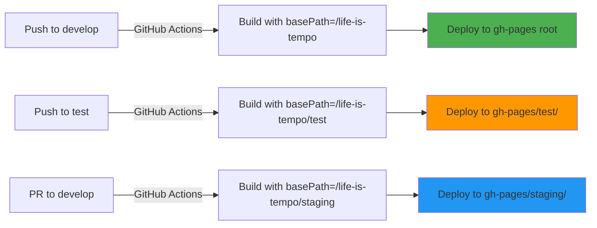

# GitHub Pages Multi-Environment Deployment Guide

**Last Updated**: 2026-02-11

---

## Overview

Life Is Tempo uses GitHub Pages with a multi-environment deployment strategy, allowing separate production, staging, and test environments to coexist on a single GitHub Pages site using subdirectories.

**Deployment URLs**:
- **Production**: https://sockshead.github.io/life-is-tempo/ (root)
- **Staging**: https://sockshead.github.io/life-is-tempo/staging/
- **Test**: https://sockshead.github.io/life-is-tempo/test/

**Key Characteristics**:
- All environments deploy to the same `gh-pages` branch
- Each environment uses a different subdirectory via `destination_dir` parameter
- Environment-specific builds using `NEXT_PUBLIC_BASE_PATH` environment variable
- `keep_files: true` ensures deployments don't overwrite each other

---

## Architecture

### Branch Strategy

| Branch | Purpose | Deployment Trigger | Target Environment |
|--------|---------|-------------------|-------------------|
| `develop` | Main development branch | Push to `develop` | Production (root) |
| `test` | Experimental features | Push to `test` | Test (`/test/`) |
| PR to `develop` | Preview before merge | PR opened/updated | Staging (`/staging/`) |

### Deployment Flow



### GitHub Pages Structure

```
gh-pages branch:
├── index.html              (production root)
├── _next/                  (production assets)
├── en/                     (production English)
├── es/                     (production Spanish)
├── staging/                (staging environment)
│   ├── index.html
│   ├── _next/
│   ├── en/
│   └── es/
└── test/                   (test environment)
    ├── index.html
    ├── _next/
    ├── en/
    └── es/
```

---

## Workflows

### Production Deployment (`deploy-production.yml`)

**Trigger**: Push to `develop` branch

**Configuration**:
```yaml
on:
  push:
    branches: [develop]
  workflow_dispatch:  # Manual deployment

environment:
  name: production
  url: https://sockshead.github.io/life-is-tempo

- name: Build static site
  run: pnpm build
  env:
    NEXT_PUBLIC_BASE_PATH: /life-is-tempo
    SKIP_ENV_VALIDATION: true

- name: Deploy to GitHub Pages
  uses: peaceiris/actions-gh-pages@v4
  with:
    github_token: ${{ secrets.GITHUB_TOKEN }}
    publish_dir: ./out
    publish_branch: gh-pages
    keep_files: true  # Preserve staging and test subdirectories
    # No destination_dir - deploys to root
```

**What it does**:
1. Builds Next.js with `basePath: "/life-is-tempo"`
2. Deploys to `gh-pages` branch root directory
3. Preserves `staging/` and `test/` subdirectories
4. Creates root `index.html` redirect to `/life-is-tempo/en.html`

### Staging Deployment (`deploy-staging.yml`)

**Trigger**: Pull request to `develop` branch

**Configuration**:
```yaml
on:
  pull_request:
    branches: [develop]
  workflow_dispatch:

environment:
  name: staging
  url: https://sockshead.github.io/life-is-tempo/staging

- name: Build static site
  run: pnpm build
  env:
    NEXT_PUBLIC_BASE_PATH: /life-is-tempo/staging
    SKIP_ENV_VALIDATION: true

- name: Deploy to GitHub Pages (Staging)
  uses: peaceiris/actions-gh-pages@v4
  with:
    github_token: ${{ secrets.GITHUB_TOKEN }}
    publish_dir: ./out
    publish_branch: gh-pages
    destination_dir: staging  # Deploy to staging/ subdirectory
    keep_files: true  # Preserve production and test deployments
```

**What it does**:
1. Triggers on PRs to `develop` for preview before merge
2. Builds with `basePath: "/life-is-tempo/staging"`
3. Deploys to `gh-pages/staging/` subdirectory
4. Provides preview URL for PR review

### Test Deployment (`deploy-test.yml`)

**Trigger**: Push to `test` branch

**Configuration**:
```yaml
on:
  push:
    branches: [test]
  workflow_dispatch:

environment:
  name: test
  url: https://sockshead.github.io/life-is-tempo/test

- name: Build static site
  run: pnpm build
  env:
    NEXT_PUBLIC_BASE_PATH: /life-is-tempo/test
    SKIP_ENV_VALIDATION: true

- name: Deploy to GitHub Pages (Test)
  uses: peaceiris/actions-gh-pages@v4
  with:
    github_token: ${{ secrets.GITHUB_TOKEN }}
    publish_dir: ./out
    publish_branch: gh-pages
    destination_dir: test  # Deploy to test/ subdirectory
    keep_files: true  # Preserve production and staging deployments
```

**What it does**:
1. Triggers on pushes to `test` branch
2. Builds with `basePath: "/life-is-tempo/test"`
3. Deploys to `gh-pages/test/` subdirectory
4. Allows testing experimental features independently

---

## Configuration

### Next.js Configuration

**Dynamic basePath** (`next.config.ts`):
```typescript
const getBasePath = () => {
  if (process.env.NEXT_PUBLIC_BASE_PATH) {
    return process.env.NEXT_PUBLIC_BASE_PATH;
  }
  return "/life-is-tempo"; // Default to production
};

const nextConfig: NextConfig = {
  output: "export", // Enable static HTML export
  basePath: getBasePath(), // Dynamic basePath based on environment
  pageExtensions: ["js", "jsx", "md", "mdx", "ts", "tsx"],
};
```

**Why dynamic basePath?**
- Allows environment-specific builds with correct asset paths
- Production: `/life-is-tempo/` (root)
- Staging: `/life-is-tempo/staging/`
- Test: `/life-is-tempo/test/`
- All asset references (CSS, JS, images) automatically prefixed correctly

### Critical Parameters

**`keep_files: true`** - REQUIRED for multi-environment coexistence

Without this parameter, each deployment would wipe all files in `gh-pages` branch, causing environments to overwrite each other.

**Example Problem** (without `keep_files`):
1. Production deploys to `gh-pages/` → Deletes all files, deploys production
2. Staging deploys to `gh-pages/staging/` → Deletes all files (including production!)
3. Result: Only staging exists, production gone

**Solution** (with `keep_files: true`):
1. Production deploys to `gh-pages/` → Keeps existing files, updates root only
2. Staging deploys to `gh-pages/staging/` → Keeps existing files, updates `staging/` only
3. Result: Both production and staging coexist

---

## Local Testing

### Test Environment-Specific Builds

```bash
# Test production build
NEXT_PUBLIC_BASE_PATH=/life-is-tempo pnpm build
grep -o 'href="/life-is-tempo/_next' out/en.html

# Test staging build
NEXT_PUBLIC_BASE_PATH=/life-is-tempo/staging pnpm build
grep -o 'href="/life-is-tempo/staging/_next' out/en.html

# Test test build
NEXT_PUBLIC_BASE_PATH=/life-is-tempo/test pnpm build
grep -o 'href="/life-is-tempo/test/_next' out/en.html
```

### Serve Locally with Subdirectory

```bash
# Build for specific environment
NEXT_PUBLIC_BASE_PATH=/life-is-tempo/staging pnpm build

# Serve from out/ directory
npx serve out

# Access at: http://localhost:3000 (note: won't match subdirectory path locally)
```

**Note**: Local server won't replicate subdirectory structure. Use `gh-pages` deployment for accurate subdirectory testing.

---

## Deployment Workflow

### Deploy to Production

```bash
# Ensure you're on develop branch
git checkout develop
git pull origin develop

# Make changes, commit
git add .
git commit -m "feat: add new feature"

# Push to trigger production deployment
git push origin develop

# Monitor deployment
gh run list --workflow=deploy-production.yml
gh run watch
```

**Result**: Deployed to https://sockshead.github.io/life-is-tempo/

### Deploy to Staging (Preview PR)

```bash
# Create feature branch
git checkout -b feature/new-feature

# Make changes, commit
git add .
git commit -m "feat: implement new feature"

# Push and create PR
git push origin feature/new-feature
gh pr create --base develop --title "feat: implement new feature"

# Staging deployment triggers automatically
# View at: https://sockshead.github.io/life-is-tempo/staging/
```

**Result**: Preview at staging URL before merging to production

### Deploy to Test

```bash
# Switch to test branch
git checkout test
git pull origin test

# Merge experimental feature
git merge feature/experimental

# Push to trigger test deployment
git push origin test

# Monitor deployment
gh run list --workflow=deploy-test.yml
```

**Result**: Deployed to https://sockshead.github.io/life-is-tempo/test/

---

## Troubleshooting

### CSS/Assets Not Loading (404 errors)

**Symptom**: Page loads but CSS/JS return 404

**Cause**: Incorrect `basePath` in build

**Solution**:
```bash
# Check what basePath was used in build
grep -o 'href="[^"]*_next' out/en.html

# Expected patterns:
# Production: href="/life-is-tempo/_next
# Staging: href="/life-is-tempo/staging/_next
# Test: href="/life-is-tempo/test/_next

# If incorrect, rebuild with correct NEXT_PUBLIC_BASE_PATH
NEXT_PUBLIC_BASE_PATH=/life-is-tempo/staging pnpm build
```

### Environment Overwriting Each Other

**Symptom**: Production deployment deletes staging/test directories

**Cause**: Missing `keep_files: true` in workflow

**Solution**: Verify all three workflows have:
```yaml
- name: Deploy to GitHub Pages
  uses: peaceiris/actions-gh-pages@v4
  with:
    keep_files: true  # THIS LINE IS CRITICAL
```

### Deployment Succeeds But Site Doesn't Update

**Cause**: GitHub Pages cache

**Solution**:
1. Wait 1-2 minutes for CDN propagation
2. Hard refresh browser (Ctrl+Shift+R / Cmd+Shift+R)
3. Check `gh-pages` branch directly:
   ```bash
   git fetch origin gh-pages
   git checkout gh-pages
   ls -la  # Verify files updated
   ```

### Wrong Environment URL

**Symptom**: Staging URL shows production content (or vice versa)

**Cause**: Subdirectory not specified in workflow

**Solution**: Verify workflow has correct `destination_dir`:
```yaml
# Production - no destination_dir (deploys to root)
# No destination_dir specified

# Staging
destination_dir: staging

# Test
destination_dir: test
```

---

## Verification Checklist

### After Production Deployment

- [ ] Visit https://sockshead.github.io/life-is-tempo/en.html
- [ ] CSS loads correctly (no 404 errors in devtools)
- [ ] Assets load from `/life-is-tempo/_next/...` path
- [ ] Page renders correctly
- [ ] No console errors

### After Staging Deployment

- [ ] Visit https://sockshead.github.io/life-is-tempo/staging/en.html
- [ ] CSS loads from `/life-is-tempo/staging/_next/...` path
- [ ] Staging content visible (not production content)
- [ ] PR preview URL accessible

### After Test Deployment

- [ ] Visit https://sockshead.github.io/life-is-tempo/test/en.html
- [ ] CSS loads from `/life-is-tempo/test/_next/...` path
- [ ] Test content visible (not production content)

### Multi-Environment Coexistence

- [ ] All three URLs accessible simultaneously
- [ ] Each environment shows correct content
- [ ] No environments overwritten after deployments
- [ ] GitHub Pages serving from `gh-pages` branch

---

## GitHub Pages Limitations

### Single Branch Deployment

GitHub Pages can only serve from ONE branch per repository. This is why all environments must deploy to the same `gh-pages` branch using subdirectories.

**Won't work**:
- Separate `gh-pages`, `gh-pages-staging`, `gh-pages-test` branches
- GitHub only serves one branch

**Does work**:
- Single `gh-pages` branch with subdirectories
- `keep_files: true` to preserve other environments

### No Server-Side Rendering

GitHub Pages only serves static files. Next.js must use `output: "export"` for static generation.

**Not supported**:
- API routes
- Server-side rendering (SSR)
- Incremental Static Regeneration (ISR)
- Middleware (except static export compatible middleware)

**Supported**:
- Static Site Generation (SSG)
- Client-side navigation
- Client-side API calls to external services

### Custom Domain Considerations

If using a custom domain (e.g., `lifeistempo.com`):
- Domain points to root of `gh-pages` branch
- Environment URLs become:
  - Production: `https://lifeistempo.com/`
  - Staging: `https://lifeistempo.com/staging/`
  - Test: `https://lifeistempo.com/test/`

---

## Advanced Topics

### Manual Deployment

Trigger deployment manually without push:

```bash
# Via GitHub CLI
gh workflow run deploy-production.yml
gh workflow run deploy-staging.yml
gh workflow run deploy-test.yml

# Via GitHub UI
# Go to Actions → Select workflow → Run workflow
```

### Rollback Procedure

GitHub Pages doesn't have built-in rollback. Use git:

```bash
# Find last good commit
git log gh-pages --oneline

# Revert gh-pages to previous commit
git checkout gh-pages
git reset --hard <commit-hash>
git push --force origin gh-pages

# Or: Deploy previous commit
git checkout <commit-hash>
git push origin HEAD:develop  # Triggers production redeployment
```

### Environment-Specific Content

Use environment variable in code:

```typescript
// components/EnvironmentBanner.tsx
export function EnvironmentBanner() {
  const basePath = process.env.NEXT_PUBLIC_BASE_PATH || '/life-is-tempo';

  if (basePath.includes('/staging')) {
    return <div className="bg-blue-600 text-white p-2 text-center">Staging Environment</div>;
  }

  if (basePath.includes('/test')) {
    return <div className="bg-orange-600 text-white p-2 text-center">Test Environment</div>;
  }

  return null; // Production - no banner
}
```

---

## Related Documentation

- [Vercel Deployment](./vercel-deployment.md) - Alternative deployment platform
- [Environment Variables](./environment-variables.md) - Complete variable reference
- [System Architecture](../architecture/system-overview.md) - Deployment architecture

---

## References

- [GitHub Pages Documentation](https://docs.github.com/en/pages)
- [peaceiris/actions-gh-pages](https://github.com/peaceiris/actions-gh-pages)
- [Next.js Static Export](https://nextjs.org/docs/app/building-your-application/deploying/static-exports)
- [Next.js basePath](https://nextjs.org/docs/app/api-reference/next-config-js/basePath)

---

**Last Updated**: 2026-02-11

**Need Help?**
- GitHub Discussions: https://github.com/Sockshead/life-is-tempo/discussions
- Project Issues: https://github.com/Sockshead/life-is-tempo/issues
